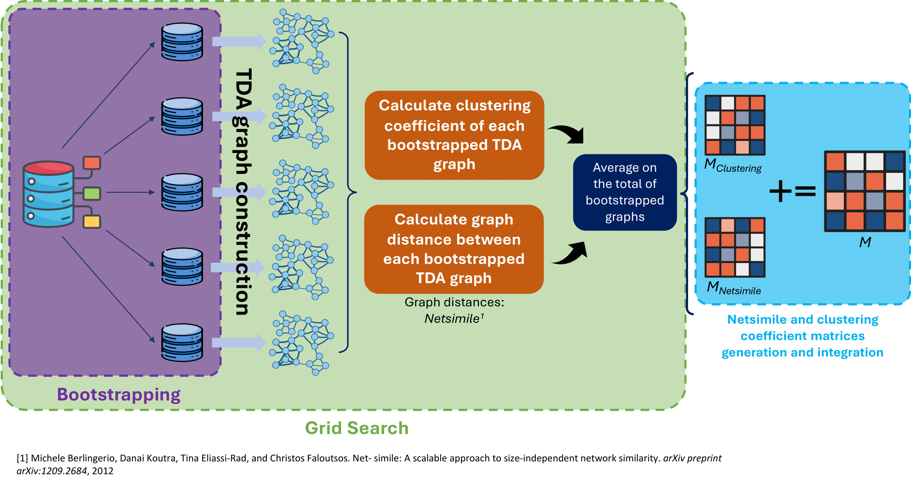

# TDA-Tuning
Topological Data Analysis (TDA) is an advanced approach to data analysis grounded in algebraic topology. It goes beyond traditional statistics by employing topological concepts to reveal inherent shapes and structures within complex datasets. Using tools like persistent homology, TDA helps identify essential topological features, offering a formal and mathematical framework for a deeper understanding of intricate data patterns.

---

## Mapper Algorithm
The Mapper algorithm plays a crucial role in TDA. Rooted in algebraic topology, Mapper is designed to reveal the Underlying structure of high-dimensional data. Using a formalized process that constructs *simplicial complex*, Mapper transforms raw data into a simplified representation, preserving essential topological information. This formal approach ensures a systematic exploration of data patterns, enhancing our understanding of intrinsic shapes and connections. 

### 1. Filtering
This operation serves as the initial stage in the algorithm, where it transforms the original data into a format suitable for further topological analysis. In this process, a filter function, also called lens function is applied to the dataset, projecting the data points from a high-dimensional representation to a smaller one. The choice of the filter function depends on the specific characteristics and objective of the analysis, as it aims to capture essential features or attribute of the data.

### 2. Covering
This operation is a critical step for simplifying high-dimensional data representation. It involves dividing the data space into overlapping intervals, or bins, associating each with a node in the TDA graph. This approach captures local structures, enhancing the algorithm ability to understand intricate data topology. By focusing on these covers, Mapper provides a nuanced representation, preserving essential information while reducing complexity.  
Covering process is governed by two key parameters: *resolution* and *gain*. The resolution regulates the number and size of intervals in the cover, while the gain controls the size of the overlap of these intervals.

### 3. Clustering
During this operation, projected points from the high-dimensional space are grouped into clusters within each bin. These clusters become nodes in the TDA graph, representing distincs data regions. Employing techniques like hierarchical clustering or k-means, this process identifies local patterns and relationships, forming a topological network that reveals the dataset underlying structure. 

---

## Tuning of Cover parameters
The parameters governing the Covering operation, namely _resolution_ and _gain_, significantly influence the ultimate representation of the TDA graph. An optimal configuration of these parameters is crucial for enhancing the quality of the graph representation. To achieve this, a method is introduced herein, integrating bootstrapping and grid search techniques. This approach aims to systematically explore various configurations of the covering parameters, with the objective of identifying the most suitable settings that yield an improved TDA graph representation. Additionally, it is crucial to underscore that this approach does not depend on specific outcomes.

### Pipeline  
_a. Parameter ranges definition:_ initially, two ranges of values are defined for both resolution and gain parameters  
_b. Grid search:_ subsequent procedures are executed iteratively within each iteration of the grid search process:  
  * Bootstrapping (without replacement)
  * TDA graph construction (using Mapper algorithm)
  * Graph distance metric (Netsimile) and clustering coefficient computation
  * Average on the total of bootstrapped graphs

    

_c. Matrix generation:_ two matrices are filled with the average results obtained at each iteration of the grid search  
_d. Matrix integration:_ Netsimile and clustering coefficient matrices are merged together to get a final score matrix  
_e. Matrix analysis and parameters combination selection:_ selection of the optimal combination of Cover parameters after an accurate matrix analysis  

#### Cover parameters combination selection
After completing the grid search, two matrices—Netsimile distances and average clustering coefficients—were generated. These matrices were combined into a unified matrix, $M$:   
$$M = \frac{{M_{Netsimile} + M_{Clustering}}}{2}$$  
Here, $M_{Netsimile}$ is the distance matrix, and $M_{Clustering}$ is the clustering coefficient matrix. They were scaled and transformed for comparability before combining. The optimal resolution and gain parameters were identified from $M$ by selecting the lowest value, indicating stable topological properties and a good clustering coefficient. This selection was further validated through qualitative assessment of the graph's visual coherence and structural integrity.  
This method, rooted in quantitative evaluations of topological features via bootstrapping and grid search, provides a robust approach for parameter configuration selection.

